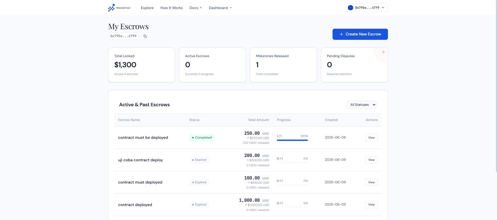
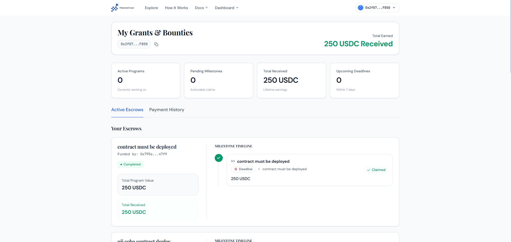
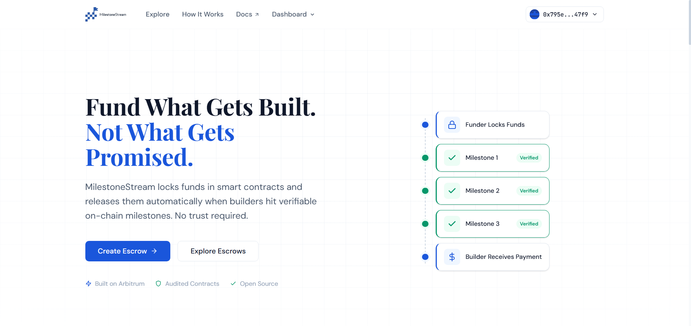

# 🌊 MilestoneStream

> **Secure, milestone-based escrow payments for builders and funders.** Built for the **Arbitrum Open House London Buildathon**.

MilestoneStream is a full-stack Web3 escrow protocol that makes grant, bounty, and contract payments trustless and milestone-driven. It allows funders to lock funds in an escrow contract, which are then released to the builder automatically via automated verifiers or optimistically after a challenge window.

---

## 📸 Screenshots & Walkthrough

Here is a preview of the MilestoneStream application:

### 1. Funder Dashboard

*Funders can easily create new escrows, define milestones, set amounts, and configure custom verifiers (e.g., contract deployment, TVL, transaction count).*

---

### 2. Builder Dashboard

*Builders can view their assigned projects, track progress, and submit claims for completed milestones.*

---

### 3. Escrow Detailed View

*A detailed view of specific escrows to track milestone states, trigger verifications, or manage disputes during the optimistic challenge window.*

---

## 💡 What Problem It Solves

Traditional grant and bounty payments suffer from a **trust dilemma**:
* **Funders** don't want to pay 100% upfront in case the work is not completed.
* **Builders** don't want to start working without proof that the funder actually has the capital and will pay.

**MilestoneStream** solves this by moving the escrow agreement on-chain:
1. **Locking Funds:** The funder locks the total payment amount into the contract at the start.
2. **Milestone Payouts:** Funds are released incrementally as milestones are completed.
3. **Flexible Verification:** Milestones can be verified automatically (using smart contract state) or optimistically (allowing builder claims with a 48-hour dispute window).

---

## ⚙️ How It Works (Protocol Architecture)

```
                       ┌─────────────────────────┐
                       │      EscrowFactory      │
                       └────────────┬────────────┘
                                    │ deploys
                                    ▼
                       ┌─────────────────────────┐
                       │     MilestoneEscrow     │
                       └────────────┬────────────┘
                                    │
            ┌───────────────────────┼───────────────────────┐
            ▼                       ▼                       ▼
┌───────────────────────┐ ┌───────────────────────┐ ┌───────────────────────┐
│  Automated Verifier  │ │   Optimistic Claim    │ │     Arbiter Dispute   │
│ (Instant Verification)│ │ (48h Challenge Window)│ │  (Manual Resolution)  │
└───────────────────────┘ └───────────────────────┘ └───────────────────────┘
```

### Pluggable Verifier System
MilestoneStream features custom verifiers implementing `IVerifier`:
* **Contract Deployed:** Checks if bytecode exists at a specific address (e.g., verifying a deployment).
* **Transaction Count:** Confirms a contract's transaction count has met a threshold.
* **TVL Threshold:** Checks if a contract has reached a specific TVL (via Chainlink price feeds).
* **Timestamp/Deadline:** Verifies milestone release after a specific time.

---

## 🛠️ Tech Stack

* **Smart Contracts:** Solidity `0.8.28`, Foundry (Testing & Scripts)
* **Frontend:** Next.js (App Router), React, Tailwind CSS
* **Web3 Integration:** RainbowKit (Wallet Connection), Wagmi & Viem (Contract Interaction)
* **Token:** Mock USDC (for local & testnet testing)

---

## 🚀 Quick Start (Local Setup)

Follow these steps to run the complete stack locally in under 5 minutes:

### 1. Prerequisites
* [Node.js 20+](https://nodejs.org/)
* [Foundry](https://book.getfoundry.sh/getting-started/installation)

### 2. Clone the Repository
```bash
git clone <repository-url>
cd milestonestream
```

### 3. Start a Local Chain
Open a terminal and start a local Anvil node:
```bash
cd contracts
anvil
```

### 4. Deploy Smart Contracts
In a new terminal window:
```bash
cd contracts
forge script script/Deploy.s.sol:DeployScript --rpc-url http://127.0.0.1:8545 --broadcast
```
*Note: Copy the contract addresses printed in the console (Factory, MockUSDC, etc.).*

### 5. Update Frontend Config
Paste the deployed contract addresses into:
`frontend/src/app/components/contracts.ts`

### 6. Run the Next.js Frontend
```bash
cd frontend
npm install
npm run dev
```
Open **[milestone-stream.vercel.app](milestone-stream.vercel.app)** in your browser. Connect your wallet using the RainbowKit button (configure MetaMask/Coinbase wallet for Anvil local network).

---

## 📜 License
This project is licensed under the MIT License.
